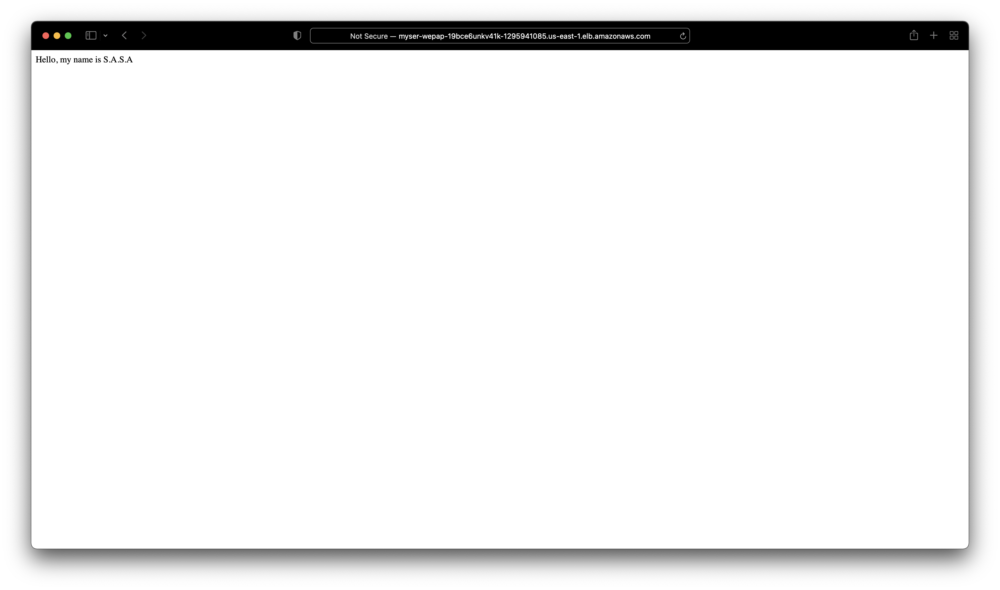
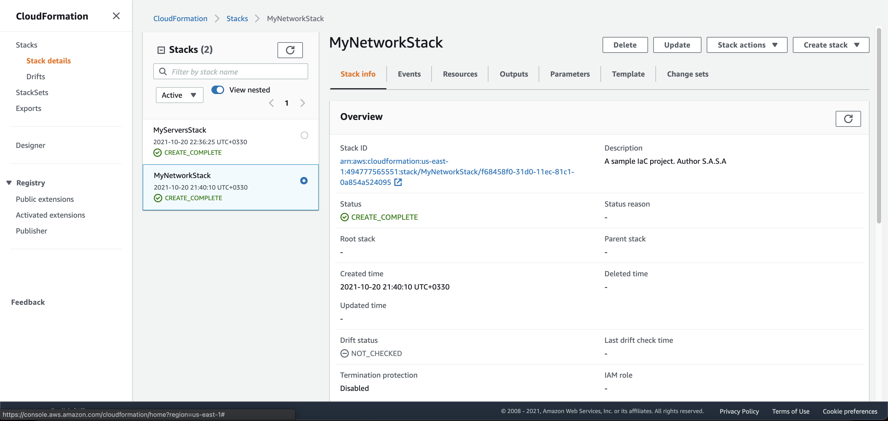
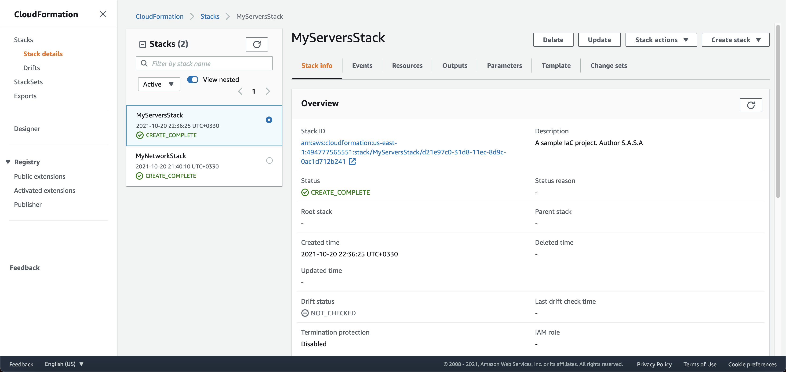

# Deploy a static website through IaC

In this project, I deployed a static website using the AWS CloudFormation technology. This project is a sample project to demonstrate using Infrastructure as Code (IaC) in the Cloud.

### Deploy infrastructures

1. Deploy network infrastructure
 * Create the CloudFormation stack
 ```
 aws cloudformation create-stack --stack-name MyNetworkStack --template-body file://Network-IaC.yaml  --parameters file://Network-Parameters.json
 ```
 * Update the CloudFormation stack
 ```
 aws cloudformation update-stack --stack-name MyNetworkStack --template-body file://Network-IaC.yaml  --parameters file://Network-Parameters.json
 ```
 * Delete the CloudFormation stack
 ```
 aws cloudformation delete-stack --stack-name MyNetworkStack
 ```

2. Deploy server infrastructure
 * Create the CloudFormation stack
 ```
 aws cloudformation create-stack --stack-name MyServersStack --template-body file://Servers-IaC.yaml  --parameters file://Servers-Parameters.json
 ```
 * Update the CloudFormation stack
 ```
 aws cloudformation update-stack --stack-name MyServersStack --template-body file://Servers-IaC.yaml  --parameters file://Servers-Parameters.json
 ```
* Delete the CloudFormation stack
 ```
 aws cloudformation delete-stack --stack-name MyServersStack
 ```

### Evidence

1. [The LoadBalancer URL](http://myser-wepap-19bce6unkv41k-1295941085.us-east-1.elb.amazonaws.com/index.html)

2. Screenshot of the deployed static website with IaC


3. Screenshots of AWS CloudFormation dashboard
 * Network infrastructure stack


* Server infrastructure stack



Author: 
S.A.S.A Razavi Omrani